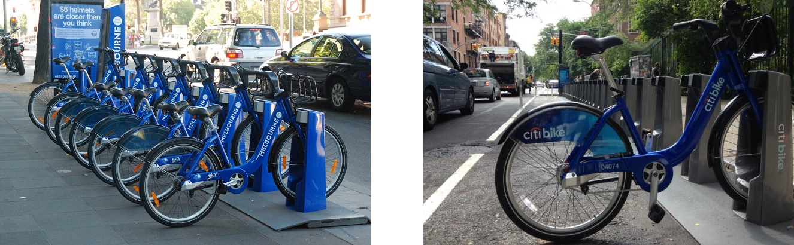
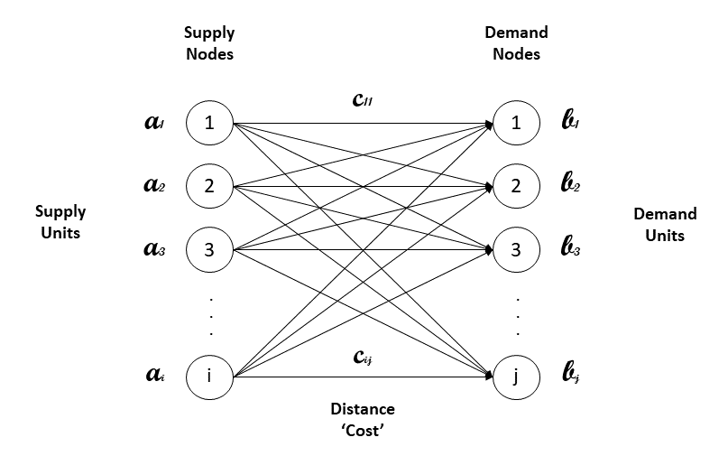

# Brief Introduction

__Linear programming__ (LP, also called linear optimization) is a method to achieve the best outcome (such as maximum profit or lowest cost) in a mathematical model whose requirements are represented by linear relationships. Linear programming is a special case of mathematical programming, also known as mathematical optimization.

Linear programming is a technique for the optimization of a linear objective function, subject to linear equality and linear inequality constraints. Its feasible region is a convex polytope, which is a set defined as the intersection of finitely many half spaces, each of which is defined by a linear inequality. Its objective function is a real-valued affine (linear) function defined on this polyhedron. A linear programming algorithm finds a point in the polytope where this function has the smallest (or largest) value if such a point exists.

# Transportation Problem (Supply & Demand) 

The transportation problem is concerned with the task of distribution of goods from any __supply__ points to any __demand__ destinations at the lowest total distribution cost possible. Each supply point has a certain supply capacity and each destination has a certain level demand that has to be __fulfilled__. The cost of transportation from one supply point to one destination varies linearly with the quantity supplied. Indeed, transportation problem is approached as a linear programming problem which can be solved by simplex method using linear programming.

The basic approach is to formulate a mathematical model as a linear programming model that represents the problem and then to analyze this model. Any linear programming model includes decision variables that represent the decisions to be made, constraints that represent the restrictions on the feasible values of these decision variables and an objective function that expresses the overall measure of performance for the problem.

# BlueBikes re-balancing approach

  

__Bluebikes__ is a fast, fun, and affordable way to get around Boston by bike. It is commonly used for public transportation and recreation. The Bluebikes system is jointly owned and managed by five municipalities in the region: Boston, Brookline, Cambridge, Everett, and Somerville. It consists of 3,000+ bikes at more than 300 stations. Since launching in 2011, residents and visitors from the city of Boston, MA have taken over 11 million trips!

Bike sharing systems offer a mobility service whereby public bicycles, located at different stations across an urban area, are available for shared use. These systems contribute towards obtaining a more sustainable mobility and decreasing traffic and pollution caused by car transportation.  

In a bike sharing system, users can take a bicycle from a station, use it to perform a journey and then leave it at a station, not necessarily the same one of departure. This behavior typically leads to a situation in which some stations become full and others are empty. Hence, a balanced system requires the redistribution of bicycles among stations.

This Jupyter Notebook will address the bike re-balancing problem in two steps. The initial step will be to use historical data to build a reliable predictive model to estimate the number of bike arrivals and departures at each station. The second step will be to build a linear programing (LP) optimization model to minimize the distance needed to re-balance all bikes across stations, satisfying the supply and demand calculated from the predictive model. For this initial approach, the intention is to develop the transportation optimization model, hence we are not going to deeply focus on the predictive model.

  

# This Project

In this project I will use a Jupyter Notebook to conduct a brief exploratory data analysis to better understand the data collected from the BlueBikes website

Furthermore, after analyzing the data, a predictive model will be build and utilized as an input for an optimization model.

The predictive model selected was a <b>Random Forest Regression</b>, which is an ensemble learning method that operates by constructing a multitude of decision trees at training time and outputting the mean prediction of the individual trees. Random decision forests correct for decision trees' habit of overfitting to their training set.

The Linear Programming model (LP) used is intended to solve a transportation problem (Supply & Demand) described above.